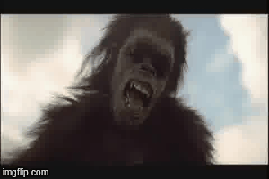

# neural-animation
Implementing neural art on video. Transform video in the artistic style of Van Gogh, Munch, or any other image using CNNs based on *A Neural Algorithm of Artistic Style* by Leon A. Gatys, Alexander S. Ecker, and Matthias Bethge using a recent Torch implemenation. 

## Example
Given an image of Edvard Munch's *The Scream*


and a clip from *2001: A Space Odyssey*   
   

We can generate that same clip from *2001: A Space Odyssey* in the artistic style of Edvard Munch's *The Scream*   
     

## Use
### Generate frames from mp4   
```
./movie2frames.sh ffmpeg [source_video] [directory_of_original_frames] jpg
```   

### Paint a new video
```
python paint.py -i [directory_of_original_frames] -o [directory_of_processed_frames] -s [style_image]
```
Optional parameters ```-sf``` and ```-ef``` for start and end frames to 'paint' on. 

### Generate mp4 or gif from processed frames
With the correct parameters, run frames2gif.sh or frames2movie.sh, or upload to imageflip. 

## Setup 
Dependencies:
* torch7
* loadcaffe
* cutorch
* CUDA 6.5+
* cudnn.torch
* ffmpeg


#### Acknowledgments
Thanks jcjohnson for providing the Lua/Torch implementation and graphix for frame manipulation. 
